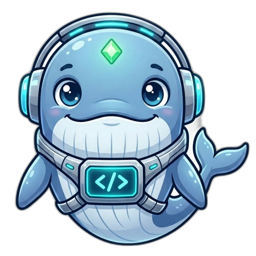
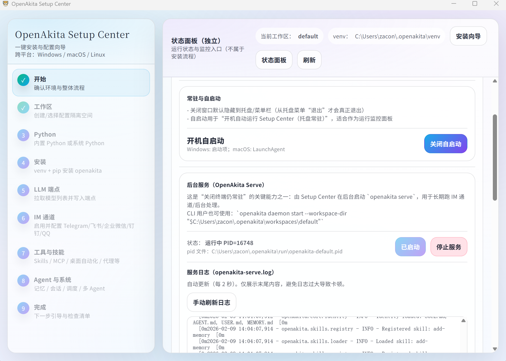
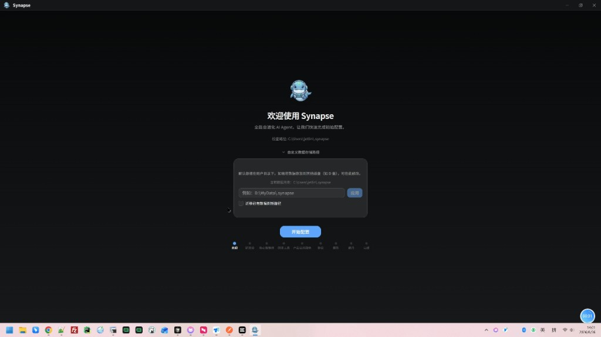
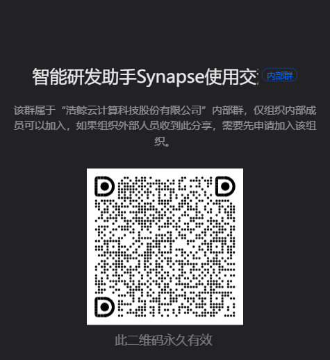

<p align="center">
  
</p>

<h1 align="center">Synapse · 智能研发助手</h1>

<p align="center">
  <strong>产品 · 知识 · SOP · 全自动研发，一站完成</strong>
</p>

<p align="center">
  <a href="https://github.com/jyhk1314/synapse/releases"></a>
  &nbsp;
  <a href="#钉钉社区"></a>
</p>

<p align="center">
  
  
  
  <a href="https://dev.iwhalecloud.com"></a>
  
  
</p>

<p align="center">
  产品管理 · 知识体系 · 规约管理 · Harness驱动研发会议室 · 评审中心 · 研发工具 · 团队视图
</p>

<p align="center">
  <a href="#什么是智能研发助手">产品介绍</a> •
  <a href="#5-分钟上手">快速开始</a> •
  <a href="#工作台">工作台</a> •
  <a href="#规约管理">规约管理</a> •
  <a href="#全自动研发流水线">全自动研发</a> •
  <a href="#扩展能力">扩展能力</a> •
  <a href="#研发云一体化">研发云</a>
</p>

---

## 什么是智能研发助手？

**普通 Copilot 只会补全代码；Synapse 在「工作台」里帮你把工单做完。**

Synapse 是 **浩鲸 BSS 团队** 自研的桌面端 + 后端服务：以 **工作台** 为日常入口，把 **产品管理、知识体系、Harness驱动研发会议室全自动执行** 串成一条可观测、可人工介入（HITL）的流水线，并与 **研发云**、**SynapseService 研发统一服务** 深度对接。

> **定位**：研发云项目空间内的开发 / 设计 / 测试人员；仓库 `git-nj.iwhalecloud.com/xmjfbss/Synapse` 持续迭代。

<p align="center">
  ☁️ <a href="https://dev.iwhalecloud.com"><b>研发云门户</b></a> &nbsp;|&nbsp;
  📖 <a href="docs/product-manager-scheme.md"><b>产品工作台方案</b></a> &nbsp;|&nbsp;
  📖 <a href="AGENTS.md"><b>AGENTS.md</b></a>
</p>

<p align="center">
  
  <br/>
  <sub>桌面端侧边栏「工作台」— 产品、工单、会议室、评审等研发主路径</sub>
</p>

---

## 5 分钟上手

**推荐路径：引导 → 工作台 → 工单 → 会议室**

| 步骤 | 操作 |
|:----:|------|
| 1 | 从 [GitHub Releases](https://github.com/jyhk1314/synapse/releases) 或仓库 [release/](release/) 目录下载安装包，完成 **研发云** 登录与 Token |
| 2 | **产品公共服务** 端口探测通过，写入 `devservice.ip` |
| 3 | 配置 **核心智能体** 与 **研发工具** Skill（`whalecloud-dev-tool-*`） |
| 4 | 打开 **产品管理**，确认产品 / 仓库 / 过程线 |
| 5 | **工单管理** 选取需求设计阶段工单 → **一键开会** → 研发会议室全自动推进 |

### 初次使用说明

首次安装启动后，按 **配置向导** 完成路径确认、研发云登录与产品公共服务探测，即可进入工作台。

<p align="center">
  
  <br/>
  <sub>桌面端首次启动 — 配置向导（发现 · 软件开发 · 核心智库 · 产业公共服务 …）</sub>
</p>


### 开发者本地运行

```bash
python -m venv .venv && .venv\Scripts\activate
pip install -e ".[dev]"
synapse serve                   # http://127.0.0.1:18900

cd apps/setup-center && npm install && npm run tauri dev
```

```bash
pytest tests/unit/              # 单元测试
ruff check src/ && ruff format src/
```

> 仓库主页（Gitea）Markdown 不支持内嵌视频；说明类动图请用 **GIF / 截图**。

---

## 工作台

桌面端 **Setup Center** 将研发主路径收敛到 **工作台** 分组（与聊天、IM 等通用能力分离）。日常研发从这里开始：

| 模块 | 入口 | 做什么 |
|------|------|--------|
| **产品管理** | `workbench_products` | 业务产品 CRUD、仓库 / 分支绑定、三维分析过程线 |
| **规约管理** | `workbench_codespec` | 规约驱动开发（CodeSpec）：变更提案、能力规范、Gherkin 场景、`codespec` 校验与归档 |
| **研发工具** | `workbench_dev_tools` | `whalecloud-dev-tool-*` 技能编排、方案 / 手册 / 脚本能力验证 |
| **工单管理** | `workbench_tickets` | 研发云工单同步、SOP 阶段、本地流水线状态、一键开会 |
| **研发会议室** | `workbench_meeting` | 按 SOP 节点 Harness 驱动，系统节点 + 人工节点全自动推进 |
| **评审中心** | `workbench_sandbox` | 组长评审 SOP、视图报告提交与复核 |
| **团队视图** | `workbench_team` | 团队维度工单覆盖、AI 使用率等管理视角 |

另有 **研发流程管理** 视图，与 SOP 配置、工序定义联动，供流程运营与会议室共用同一套节点语义。

---

### 产品管理

对接 SynapseService **产品公共服务**（`~/.synapse/devservice.ip`），以产品为粒度管理研发资产：

| 能力 | 说明 |
|------|------|
| **产品卡片** | 列表展示代码 / 文档 / 工单三条 **分析过程线**；支持刷新、编辑、删改仓库 |
| **仓库关联** | 应用模块、产品分支、`prod_branch`、Git URL、Token 校验、`change_repo_info` |
| **产品详情** | 多 Tab：**代码仓库** · **知识分类** · **工单视图** — 统一从产品进入 |
| **自动分析** | 触发 GitNexus 索引、文档分析、工单图谱生成；后台异步更新过程线状态 |
| **权限** | 基于研发云 `userId` 与 `owner_info` 的产品 / 团队 / 部门可见范围 |

---

### 知识体系

产品详情内嵌 **三维知识能力**，由研发统一服务端口集群支撑（引导期 `ob-devservices` 一次性探测）：

| 维度 | 端口（示例） | 工作台呈现 |
|------|-------------|------------|
| **代码图谱** | `11001` / `11011` | 依赖解析 iframe、GitNexus 初始化 / 重分析 |
| **工单图谱** | `12001` / `12011` | 近 30 日改造工单关系、工单知识图谱嵌入 |
| **业务知识图谱** | `13001` / `13011` | 产品知识视图、分类文档、混合检索入口 |
| **语雀** | Synapse API | 产品文档读写（`yuque` 路由） |
| **研发文档链** | 工单沙箱 `synapse_archive/` | 需求澄清 → 模块功能 → 函数级方案，与 AGENTS.md 规范联动 |

智能体在会议室 / 子任务中通过 **GitNexus MCP** 与 **whalecloud-dev-tool-base-scripts** 脚本拉取上述知识，避免「无依据臆造」。

---

### 规约管理

**先写规范、再写代码**：工作台内置 **规约驱动开发（Spec-Driven Development）** 能力，配套命令行 `codespec`，让 AI 在明确边界内产出可审计、可演进的实现，与会议室 / 工单流水线作为 **上游约束** 衔接：

| 能力 | 说明 |
|------|------|
| **变更提案** | `codespec propose "<desc>"` 生成 `changes/<change-id>/`：`proposal.md`（Why / What Changes）+ 可选 `design.md` / `tasks.md` |
| **能力规范** | `specs/<capability>/spec.md` 作为业务子域「真理之源」；`Delta` 支持 `ADDED` / `MODIFIED` / `REMOVED` / `RENAMED` |
| **Gherkin 场景** | 每条 `Requirement` 至少配一个 `Scenario`，用业务语言描述「什么条件下应有什么行为」，模糊点在写规范阶段即暴露 |
| **校验门禁** | `codespec validate --strict` 缺场景即报错；可接入 CI / 流水线作为 MR 合并门禁 |
| **知识库同步** | `codespec knowledge upload / download` 与 SDD Admin 项目知识库双向同步，sha1 去重 |
| **三层规约** | L1 基线（强制规则）> L2 产品线（BSS / CRM）> L3 项目；低层级可加严、不可放松，作为 AI 系统提示词注入 |

```
proposal（为什么改） → spec Delta（改成什么样） → validate（结构校验）
        │                      │                       │
        ▼                      ▼                       ▼
   团队评审               Gherkin 场景            AI / 人工实现 → archive 归档入 specs/
```

> 规约是 **随代码演进的活资产**，与 Confluence「长期沉淀手册」职责互补；规约产出可作为会议室智能体的提示词上下文，让生成代码「有据可依」。详见 [CodeSpec 用户手册](docs/codespec-manual.md)。

---

### Harness驱动研发会议室

研发交付不是自由对话，而是 **SOP 阶段 + 节点 Harness** 约束下的执行：

```
SOP Manifest（系统只读）
  阶段 1～5：需求分析 → 需求设计 → 需求研发 → 开发中 → 代码走查
  每阶段若干 node_id：主旨 intent、依赖图、验收契约
        │
        ▼
Meeting Room Config（可运营）
  按 node_id 引用 profile_id / skill_ids / llm_endpoint_key
        │
        ▼
Harness 运行时（rd_meeting/）
  智能小鲸 Host 委派 Worker · Ralph 循环 · HITL 打断 · dev.status 真相源
```

| 概念 | 含义 |
|------|------|
| **SOP Manifest** | 节点结构、主旨、依赖 — **Harness 核心**，用户不可改拓扑 |
| **Meeting Room Config** | 节点级智能体 / Skill / 模型配置 — 运营可调整 |
| **智能小鲸（Host）** | 按当前节点推进议程、委派、验收、汇总 |
| **Worker** | 在 Profile + Skill 边界内执行当前议程（改码、写文档、编译等） |
| **HITL** | 关键节点人工确认；「重新处理」指令优先级高于历史结论 |

工单列表与会议室 **共用 SOP 视图**：`sop_node`、`local_process_state` 与研发云状态对齐。

---

### 全自动研发流水线

从工单 **需求设计** 阶段起，可 **一键开会**，进入全自动（可 HITL 打断）流水线：

```
研发云工单（需求设计+）
        │
        ▼
  工单管理 · 一键开会
        │
        ▼
┌──────────────────────────────────────────┐
│  研发会议室 MeetingRoomBoard            │
│  Live 轮询 · 节点看板 · 系统节点卡片     │
└───────┬──────────┬──────────┬──────────┘
        ▼          ▼          ▼
   需求澄清    方案评审    任务拆分 / 自动拆单
        │          │          │
        ▼          ▼          ▼
   沙箱落盘    文档生成    Cursor / CLI 改码
   多仓并行    synapse_archive   编译试飞 · flight result
        │          │          │
        └──────────┴──────────┘
                   ▼
        代码走查 · 评审中心 · Gitea 合码 · 回写研发云
```

**系统节点**（示例）：沙箱落盘、方案评审、任务检查、编码执行、编译验证、差异分析、合码申请等 — 由 `rd_meeting/system_nodes.py` 等与 Skill 脚本衔接。

**评审中心** 承接组长 SOP：视图报告生成、Reviewer 流转、与会议室产物对齐。

---

## 架构概览

```
┌──────────────────────────────────────────────────────────────┐
│  工作台（Setup Center）                                       │
│  产品管理 · 知识体系 · 规约管理 · 工单 · 会议室 · 评审 · 研发工具 · 团队 │
└────────────────────────────┬─────────────────────────────────┘
                             │
┌────────────────────────────▼─────────────────────────────────┐
│  Synapse Backend                                              │
│  rd_meeting/（SOP·Harness·会议室）  dev_iwhalecloud/  gitnexus/ │
│  yuque/ · agents/ · tools/ · skills/whalecloud-dev-tool-*    │
└────────────┬───────────────────────┬─────────────────────────┘
             ▼                       ▼
    dev.iwhalecloud.com         SynapseService + 图谱端口集群
    git-nj · work/<工单>/       （devservice.ip）
```

| 路径 | 职责 |
|------|------|
| `apps/setup-center/src/components/product/` | 产品管理工作台 UI |
| `apps/setup-center/src/components/rd-manage/` | 工单、会议室、评审中心 |
| `apps/setup-center/src/components/codespec/` | 规约管理工作台 UI（变更 / 规范 / 校验） |
| `src/synapse/rd_meeting/` | SOP 编排、系统节点、Harness 运行时 |
| `src/synapse/api/routes/dev_iwhalecloud.py` | 研发云代理、合码 |
| `skills/whalecloud-dev-tool-*` | 研发工具链 Skill |

---

## 研发云一体化

`dev_iwhalecloud/` 对接 **[dev.iwhalecloud.com](https://dev.iwhalecloud.com)**，为工单同步、仓库元数据与 Gitea 合码提供连接层；引导期完成门户登录后工作台内自动保活，日常无需单独维护。

| 能力 | 说明 |
|------|------|
| **工单 / 仓库** | 「与我相关」工单整点同步；产品分支与模块列表供产品管理选仓 |
| **合码回写** | Playwright 驱动 Gitea MR；会话与 CSRF 由 `iwhalecloud_session.json` 维护 |

---

## 扩展能力

以下能力继承自 Synapse 开源底座，**非工作台主路径**，可按需开启（详见 [README_CN.md](README_CN.md)）：

| 类别 | 说明 |
|------|------|
| **对话 / CLI** | 通用 Chat、`synapse run` 单次任务 |
| **多 Agent** | Orchestrator 委派、子 Agent、Ralph 循环（会议室内已深度使用） |
| **IM 通道** | 飞书 / 钉钉 / 企微 / Telegram / QQ / OneBot |
| **记忆** | 碎片化记忆 + MDRM 图谱 |
| **插件 / MCP** | 通用插件市场、额外 MCP Server |
| **调度 / 人格** | 定时任务、多 Persona |
| **沙箱安全** | 六层策略（改码节点默认启用 OS 级隔离） |

---

## 文档

| 文档 | 内容 |
|------|------|
| [docs/product-manager-scheme.md](docs/product-manager-scheme.md) | 产品公共服务 + 产品管理工作台 |
| [docs/synapse/多智能体研发会议室实现方案.md](docs/synapse/多智能体研发会议室实现方案.md) | SOP · Harness · 会议室契约 |
| [docs/localization/setup-center-product-rd-workbench.md](docs/localization/setup-center-product-rd-workbench.md) | 工作台引导与门禁 |
| [docs/codespec-manual.md](docs/codespec-manual.md) | 规约管理 · CodeSpec 用户手册（规约驱动开发） |
| [DIFF.md](DIFF.md) | 与上游 openakita 差异 |
| [README_CN.md](README_CN.md) | 开源底座完整特性（IM、记忆、插件等） |
| [AGENTS.md](AGENTS.md) | 开发规范与构建命令 |
| 统一服务 `GET /dev/iwhalecloud/synapse/platform_stats` | 内网平台统计；GitHub README 徽章为静态展示，Gitea 见 `scripts/sync_platform_stats_badges.py` |

---

## 交流与反馈 {#钉钉社区}

<p align="center">
  <strong>智能研发助手 Synapse 使用交流群</strong><br/>
  钉钉群号：<code>174735022344</code>
</p>

<p align="center">
  
  <br/>
  <sub>打开钉钉扫一扫加入群聊</sub>
</p>

---

## 致谢

- [OpenAkita](https://github.com/openakita/openakita) — 上游多 Agent 内核
- **GitNexus** · **浩鲸研发云** · **SynapseService** — 知识与工单基础设施

---


<p align="center">
  <strong>Synapse · 智能研发助手 — 工作台驱动的 BSS 团队 AI 研发交付</strong><br/>
  <sub>浩鲸科技 · BSS 团队 · 内部研发使用</sub>
</p>
